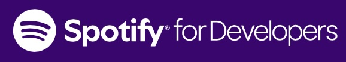

<<<<<<< HEAD
# Getting Started with Create React App

This project was bootstrapped with [Create React App](https://github.com/facebook/create-react-app).

## Available Scripts

In the project directory, you can run:

### `npm start`

Runs the app in the development mode.\
Open [http://localhost:3000](http://localhost:3000) to view it in your browser.

The page will reload when you make changes.\
You may also see any lint errors in the console.

### `npm test`

Launches the test runner in the interactive watch mode.\
See the section about [running tests](https://facebook.github.io/create-react-app/docs/running-tests) for more information.

### `npm run build`

Builds the app for production to the `build` folder.\
It correctly bundles React in production mode and optimizes the build for the best performance.

The build is minified and the filenames include the hashes.\
Your app is ready to be deployed!

See the section about [deployment](https://facebook.github.io/create-react-app/docs/deployment) for more information.

### `npm run eject`

**Note: this is a one-way operation. Once you `eject`, you can't go back!**

If you aren't satisfied with the build tool and configuration choices, you can `eject` at any time. This command will remove the single build dependency from your project.

Instead, it will copy all the configuration files and the transitive dependencies (webpack, Babel, ESLint, etc) right into your project so you have full control over them. All of the commands except `eject` will still work, but they will point to the copied scripts so you can tweak them. At this point you're on your own.

You don't have to ever use `eject`. The curated feature set is suitable for small and middle deployments, and you shouldn't feel obligated to use this feature. However we understand that this tool wouldn't be useful if you couldn't customize it when you are ready for it.

## Learn More

You can learn more in the [Create React App documentation](https://facebook.github.io/create-react-app/docs/getting-started).

To learn React, check out the [React documentation](https://reactjs.org/).

### Code Splitting

This section has moved here: [https://facebook.github.io/create-react-app/docs/code-splitting](https://facebook.github.io/create-react-app/docs/code-splitting)

### Analyzing the Bundle Size

This section has moved here: [https://facebook.github.io/create-react-app/docs/analyzing-the-bundle-size](https://facebook.github.io/create-react-app/docs/analyzing-the-bundle-size)

### Making a Progressive Web App

This section has moved here: [https://facebook.github.io/create-react-app/docs/making-a-progressive-web-app](https://facebook.github.io/create-react-app/docs/making-a-progressive-web-app)

### Advanced Configuration

This section has moved here: [https://facebook.github.io/create-react-app/docs/advanced-configuration](https://facebook.github.io/create-react-app/docs/advanced-configuration)

### Deployment

This section has moved here: [https://facebook.github.io/create-react-app/docs/deployment](https://facebook.github.io/create-react-app/docs/deployment)

### `npm run build` fails to minify

This section has moved here: [https://facebook.github.io/create-react-app/docs/troubleshooting#npm-run-build-fails-to-minify](https://facebook.github.io/create-react-app/docs/troubleshooting#npm-run-build-fails-to-minify)
=======


# Spotify Project

This repository contains various files, scripts, and applications I created using Spotify's Web API. The files serve different purposes: some are standalone applications, while others are reusable functions and scripts that may be used across multiple applications.

## Table of Contents

*   🙋 [What is covered in this README?](#what-is-covered-in-this-readme)
*   🌐 [Global Dependencies](#global-dependencies)
   *   🕸️ [Spotify Web API](#spotify-web-api)
   *   📚 [Libraries](#libraries)
*   ⏬ [Install](#install)
*   🗂️ [Contents](#contents)
   *   💻 [Projects](#projects)
   *   📝 [Scripts](#scripts)
*   🤝 [Contribute](#contribute)
*   ©️ [License](#license)
*   🔌 [Sources](#sources)

## What is covered in this README
This README intends to provide a high-level overview of the files and folders of significance in this repository. 

## Global dependencies
_Note: local dependencies for folders within this repository will be detailed in their respective READMEs_
   * ### [Spotify Web API](https://developer.spotify.com/documentation/web-api)
      *  [Spotipy](https://spotipy.readthedocs.io/en/2.24.0/) is a lightweight Python library for the Spotify Web API. With Spotipy you get full access to all of the music data provided by the Spotify platform.  
   * ### Libraries
      * [dotenv](https://pypi.org/project/python-dotenv/) - Used to read key-value pairs from a `.env` file and can set them as environment variables. Specifically utilized in this repo to boost security by storing and loading sensitive API credentials.
      * [os](https://docs.python.org/3/library/os.html) - Python's built-in module for interacting with the operating system. This is used with `dotenv` to execute the retrieval of environmental variables.


## Install
Use git to clone this repository into your computer.

```
git clone https://github.com/ndcarlos/spotify-project
```

## Contents
Files denoted with 🏗️ are not yet complete.

   * ### Projects
     (each contained in their folder)
      * 🏗️ [`wander`](https://github.com/ndcarlos/spotify-project/blob/main/wander/README.md): New artist discovery tool.


   * ### Scripts 
      * [`get_token.py`](https://github.com/ndcarlos/spotify-project/blob/main/get_token.py): Retrieves authorization tokens from Spotify Web API and stores it as `access_token`


## Contribute
Pull requests are welcome. For major changes, please open an issue first to discuss what you would like to change.

Please make sure to update tests as appropriate.

## License
[MIT](https://choosealicense.com/licenses/mit/)

## Sources

[react-markdown][react-markdown] - Project which served as an inspiration for this README

[Blog post templates][blog-post-templates] - Used to structure this template as an easy-to-read blog post

[About markdown][about-markdown] - Why should you use markdown?

[Markdown Cheat Sheet][markdown-cheatsheet] - Get a fast overview of the syntax

[//]: # "Source definitions"
[blog-post-templates]: https://backlinko.com/hub/content/blog-post-templates "Backlinko blog post templates"
[about-markdown]: https://www.markdownguide.org/getting-started/ "Introduction to markdown"
[markdown-cheatsheet]: https://www.markdownguide.org/cheat-sheet/ "Markdown Cheat Sheet"

>>>>>>> d46ed75aff37d176b88889cda74f9a5aaf22aab5
