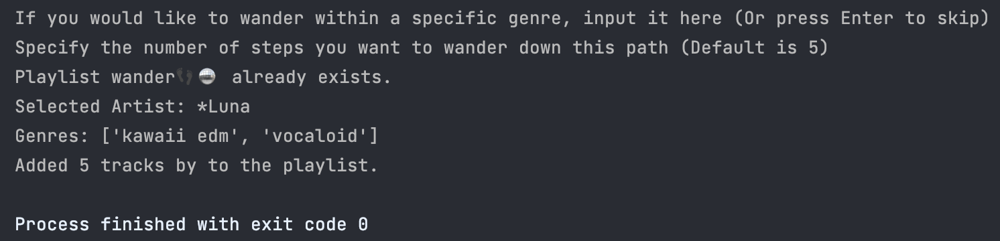

# wander

With so many artists to choose from, it can be overwhelming to find new music. Wander curates and fills your wander👣🪩 playlist with personalized recommendations, helping you discover and explore fresh artists.

## Table of Contents

*   [🙋 What is covered in this README?](#what-is-covered-in-this-readme)
*   [🌐 Global dependencies](#global-dependencies)
*   [📍Local dependencies](#local-dependencies)
*   [🚀 Getting started](#getting-started)
*   [🗂️ Main contents](#main-contents)
*   [🤝 Contribute](#contribute)
*   [©️ License](#license)
*   [🔌 Sources](#sources)

## What is covered in this README
This README intends to provide a high-level overview of [wander](https://github.com/ndcarlos/spotify-project/tree/main/wander) subfolder to [spotify-project](https://github.com/ndcarlos/spotify-project/tree/main). 

## Global dependencies
See the repository level [README](https://github.com/ndcarlos/spotify-project/blob/main/README.md).

## Local dependencies
* [random](https://docs.python.org/3/library/random.html#random.choice) - This module implements pseudo-random number generators for various distributions. Here it is used in selecting a random artist from a JSON object.

## Getting started
See the [getting started](https://github.com/ndcarlos/spotify-project/blob/main/wander/gettingstarted.md) documentation.

## Main Contents
Scripts denoted with 🏗️ are not yet complete.
* [wander.py](https://github.com/ndcarlos/spotify-project/blob/main/wander/wander.py) - New artist discovery tool.
* [wander_ex20241129](https://github.com/ndcarlos/spotify-project/blob/main/wander/wander_ex20241129.png) - Header image for the readme

## Contribute
Pull requests are welcome. For major changes, please open an issue first to discuss what you would like to change.

Please make sure to update tests as appropriate.

## License
[MIT](https://choosealicense.com/licenses/mit/)

## Sources

[react-markdown][react-markdown] - Project which served as an inspiration for this README

[Blog post templates][blog-post-templates] - Used to structure this template as an easy-to-read blog post

[About markdown][about-markdown] - Why should you use markdown?

[Markdown Cheat Sheet][markdown-cheatsheet] - Get a fast overview of the syntax

[//]: # "Source definitions"
[react-markdown]: https://github.com/remarkjs/react-markdown "React-markdown project"
[blog-post-templates]: https://backlinko.com/hub/content/blog-post-templates "Backlinko blog post templates"
[about-markdown]: https://www.markdownguide.org/getting-started/ "Introduction to markdown"
[markdown-cheatsheet]: https://www.markdownguide.org/cheat-sheet/ "Markdown Cheat Sheet"

